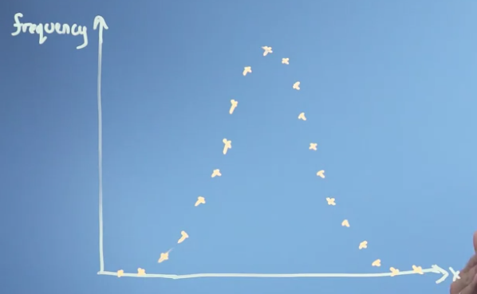
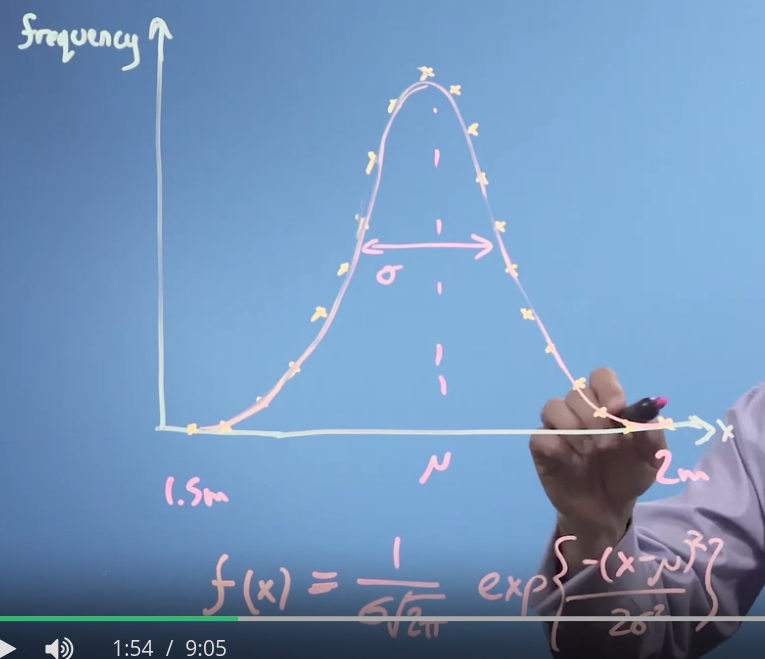
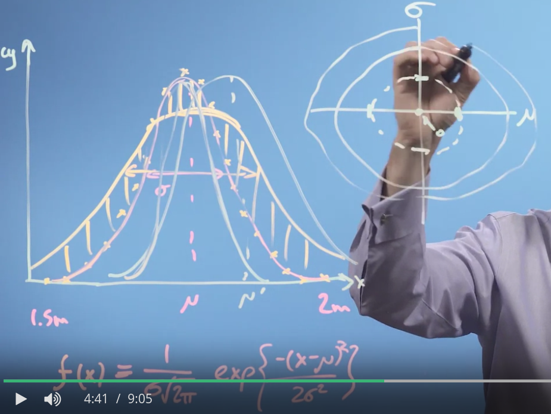
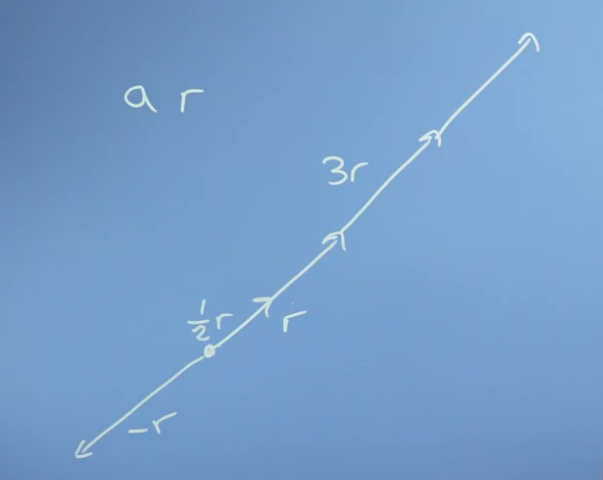
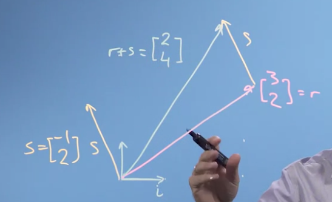
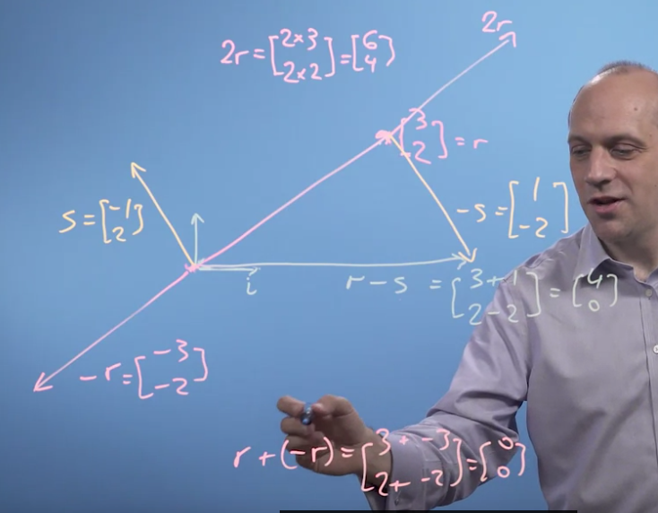

# The relationship between machine learning, linear algebra, vectors & matrices

## Getting a handle on vectors

+ Phân tích ví dụ, biểu đồ phân bố chiều cao người .

    - Chúng ta sẽ đi lấp đầy (fitting) biểu đồ này bằng 1 phương trình (equation) ~ **f(x)** mô tả sự thay đổi chiều cao.
        - tham số  *mu*: thể hiện chiều cao biểu đồ
        - tham số  *sigma*: thể hiện độ rộng của biểu đồ

+ Đánh giá về biểu đồ.

    - Đồ thị phân bố theo phân phối Gaussian. Được chuẩn hóa (**norm**) = 1
    - *Để fitting mô hình, ta cần tìm tham số phù hợp (fit) với dữ liệu nhất.*

+ Giả sử, chúng ta sẽ đưa ra các dự đoán: 

    - Chiều cao & độ rộng của biểu đồ sẽ chênh lệch so với biểu đồ thực. 
    - Mô phỏng trục giá trị giao nhau của 2 tham số: *sigma* & *mu*
        - Chúng tạo thành các đường cung khép kín trên trục.
    - Việc thay đổi cặp giá trị 2 tham số coi như sự di chuyển của vector tạo bởi cặp giá trị tham sô trên hệ trục tọa độ.
    - Việc giảm giá trị của cặp tham số là công việc của **giải tích** 

# Vector 

+ Có thể coi vector như những đặc trưng của một đối tượng.
    - Ex: nhà {120m, 4 phòng, 5 cửa sổ ...}
    - r = []
    

+ Two rules:
    - Addition
        - r + s = s + r
    
    
    - Multiplication by a scalar number  

    
