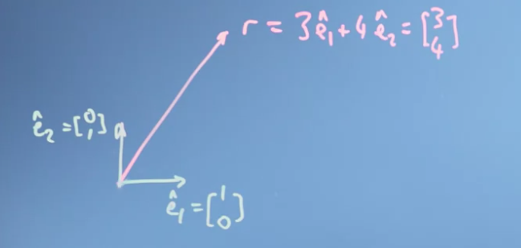

# Finding the size of a vector, it's angle & projection

## Modules & inner product

+ Length of a vector:
    - r = a*i + b*j
    

+ Product vectors:  
    

## Cosine & dot product

+ Cosine rule:

    

    - Transform to vectors:  
    
    

# Changing the reference frame

## Changing basis

+ Thay các đơn vị i, j bằng các ma trận đơn vị *e_1=(1, 0)*, *e_2=(0, 1)*. Biểu diễn bất kì vector bằng các ma trận đơn vị.

