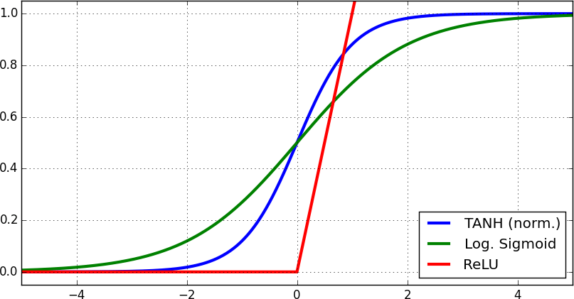
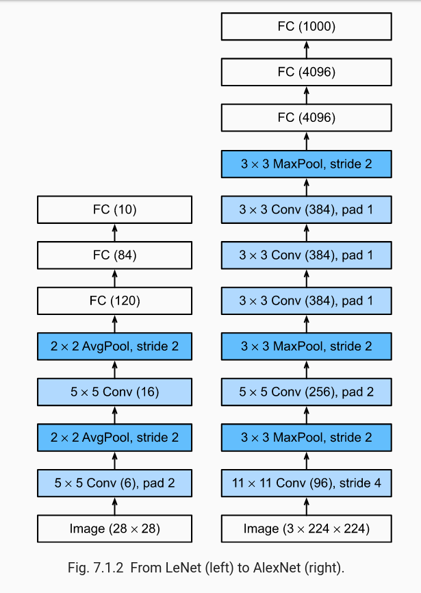
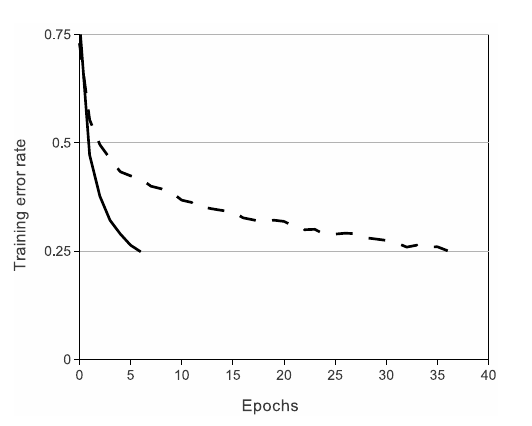

# ImageNet Classification with Deep Convolutional Neural Networks - AlexNet 

## 0. Giải thích các khái niệm 

Phần này chúng ta sẽ đi làm rõ các kiến thức/nội dung nhỏ đề cập đến trong paper. Deeper !

### 0.1 Non-Saturating & Saturating neurons

+ Hầu hết các kiến trúc mạng neuron trong machine learning sử dụng hàm kích hoạt phi tuyến tính cho việc kết hợp các đầu vào tuyến tính. Công thức phổ biến mọi người biết đến: 

    

+ Hiện tượng bão hòa xảy khi các hàm kích hoạt đạt giá trị cận biên trên/biên dưới ứng với mỗi vùng hoạt động của hàm kích hoạt. Ví dụ: tanh() có giá trị trong khoảng [-1, 1]; softmax() có gía trị trong khoảng [0, 1]. 

+ Hiện tượng bão hòa này gây ra tốn thời gian cập nhật trọng số  (update the weights) vì giá trị của gradient rất nhỏ. Để xuất giải quyết vấn đề này, hiện nay nhiều mô hình hiện đại sử dụng cấu trúc khối Conv {Conv -> MaxPooling -> ReLU}

+ Ngoài ra, mình có viết bài chi tiết về **activation functions** tại [đây](https://github.com/Doan-Nguyen/Deep_Learning_Notes/blob/master/Topics/Activations%20Functions.md).

### 0.2 Overfitting & Drop-out 

#### 0.2.1 Overfitting 
+ Overfitting có thể hiệu mô hình học tốt trên tập train, nhưng kết quả trên tập valid lại không tốt. Một ví dụ thường được dùng để mô tả hiện tương này trong đời thực là việc học tủ. Hiện tượng này có thể do mô hình quá phức tạp trong khi dữ liệu training lại nhỏ.

+ Cách thức phát hiện/đánh giá *overfitting*:
    - Trước tiên, ta cần đánh giá chất lượng mô hình trên tập train & tập valid. Thường sẽ dùng *lỗi trung bình bình phương* (**Mean Squared Error**). Với classification, người ta cũng có thể sử dụng **cross entropy**.
    - Overfitting <=> E_train nhỏ; E_valid lớn
    - Underfitting <=> E_train lớn; E_valid nhỏ

+ Cách thức giải quyết:

#### 0.2.2 Drop-out 
+ Được hiểu là kĩ thuật giúp ẩn đi các unit trong mô hình. Việc ẩn ở đây được hiểu các unit sẽ có giá trị 0.

### 0.3 Local Response Normalization
+ 

### 0.4 Stochastic gradient descent

## 1. Tóm tắt nội dung chính 

### 1.1 Tư tưởng chính 
+ So với mạng LeNet được xuất hiện trước đó, AlexNet đã tăng độ sâu hơn hơn so với LeNet-5. Số lượng filters trên mỗi lớp cũng tăng lên. 
    - LeNet: 2*{convolutional_layer + pool} + 3*{fully_connected_layer}
    - AlexNet: 5*{convolutional_layer + MaxPool + ReLU} + 3*{fully_connected_layer}

    

+ Bài báo đề xuất sử dụng non-saturating neurons nhằm giảm thời gian trainning. Ngoài ra, bài báo còn đề xuất các phương pháp khắc phục hiện tượng overfitting như *dropout*

+ Hạn chế hiện tượng over-fitting tại lớp fully-connected, tác giả sử dụng phương pháp **dropout** & **data augmentation**

### 1.2 Các đề xuất của thuật toán 

+ AlexNet thay thế hàm kích hoạt *sigmoid()* bằng hàm *ReLU()*. Giúp giảm thời gian training xuống 25%.

+ Giải quyết vấn đề overfitting bằng:
    - Data augmentation
    - Dropout

+ Sử dụng *Local Response Normalization* nhằm 

+ Sử dụng *Overlap pooling* nhằm giảm kích thước mạng.

### 1.3 Kiến trúc AlexNet

+ Kiến trúc mạng AlexNet gồm 8 lớp (5 **Convolutional Layers** + 3 **Fully Connected Layers**):
    - 5 Convolutional Layers:
        - Hai lớp conv đầu tiên & lớp thứ 5 được kết nối thêm **Overlapping MaxPooling Layers**
        - Ba lớp conv cuối được nối trực tiếp với nhau
    - 3 Fully Connected Layers:
        - 2 Fully Connected Layers 
        - 1 SoftMax layer

+ ReLU non-linearity được sử dụng cho tất các conv layers & fully connected layers.

+ **Overlapping MaxPooling Layers**:
    - Thường được sử dụng nhằm giảm kích thước chiều rộng & chiều cao của tensor đầu vào nhưng vẫn giữ được độ sâu của output.

## Tham khảo

1. Saturated neural

+ [Why would a saturated neuron be a problem?](https://www.quora.com/Why-would-a-saturated-neuron-be-a-problem)

+ [What Is Saturating Gradient Problem](https://datascience.stackexchange.com/questions/27665/what-is-saturating-gradient-problem#:~:text=Saturating%20means%20that%20after%20some,a%20solution%20for%20this%20problem.)

[Understanding AlexNet](https://www.learnopencv.com/understanding-alexnet/#:~:text=AlexNet%20consists%20of%205%20Convolutional,kernels%20of%20the%20same%20size.)

[A Review of Popular Deep Learning Architectures](https://blog.paperspace.com/popular-deep-learning-architectures-alexnet-vgg-googlenet/)