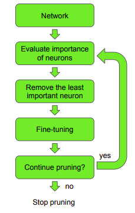

# Pruning model neural network to make them faster & smaller.

Bài viết được dịch từ tác giả của bài viết & bài báo được đề xuất **Jacob Gildenblat**. Link bài viết gốc [Link](https://jacobgil.github.io/deeplearning/pruning-deep-learning)

+ Ý tưởng về cắt tỉa mô hình xuất hiện trước đó từ những năm 1990 (Yann Le Cun đề cập trong bài báo *Optimal Brain Damage*). Trong mô hình học máy với rất nhiều tham số, sẽ tồn tại các tham số cần thiết và ngược lại. Nếu như ta phân loại được mức độ cấp bậc vai trò trong mạng & cắt tỉa bớt chúng sẽ giúp mô hình nhỏ & nhanh hơn.

## Việc giảm kích thước/tăng tốc độ mô hình quan trọng với các mô hình chạy trên các thiết bị di động.

+ Quá trình cắt tỉa mô hình được minh họa: 

## Lý do tại sao kĩ thuật này chưa phổ biến 

+ Các lý do lý trấu:
    - Các phương pháp phân cấp chưa đủ tin cậy để có thể áp dụng, kết quả sau quá trình cắt tỉa độ chính xác giảm.
    - Phức tạp để thực hiện.
    - Ngại chia sẻ, bí quyết ...

