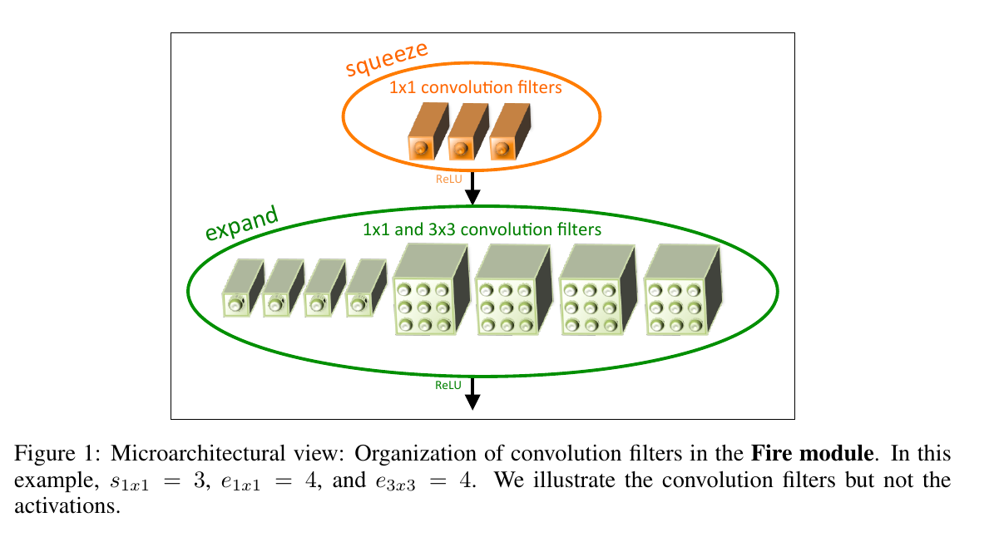
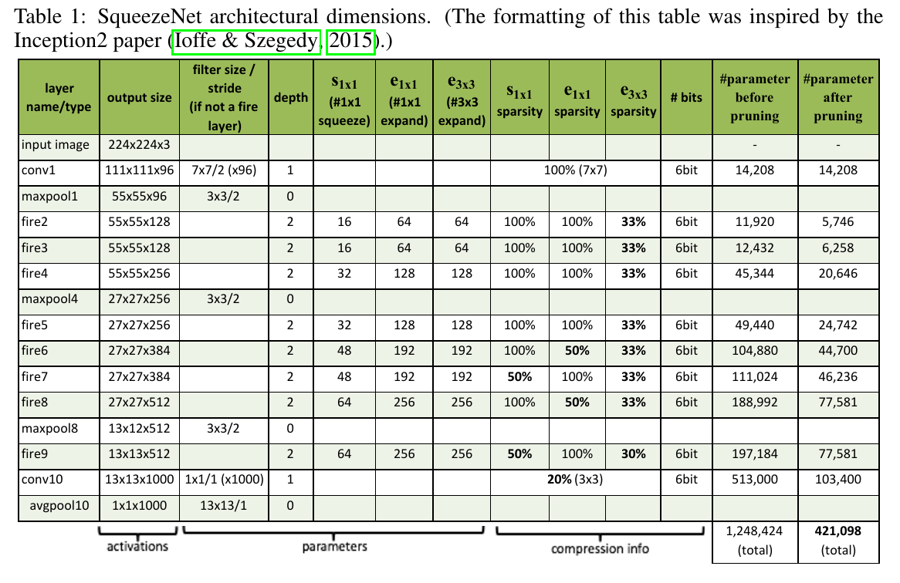
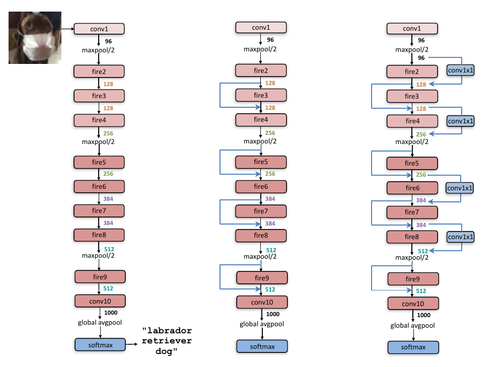

# SQUEEZENET: AlexNet-Level Accuracy With 50x Fewer Parameters and < 0.5 MB Size

## Abstract 

+ Smaller CNN architecture advantage:
    - Require less communication across servers during distributed training -> train faster.
    - Require less bandwidth to exported a new model.
    - More feasible to deploy 

## 1. Introduction & Motivation 

+ The paper is organized:
    - Describe & evaluate the SqueezeNet architecture
    - How CNN architecture design choices impact model size & accuracy.
    - Design space exploration on the CNN *micro-architecture* - as define organization & dimension of individual layers & modules.
    - Design space exploration on the CNN *macro-architecture* ~ as define high-level organization of layers

## 2. Related Work

### 2.1 Model Compression

+ Network Pruning:
    - Using pre-trained model
    - Replaces parameters that a below a certain threshold with zeros to form a sparse matrix
    - Finally, performs a few iteration of training.
+ *Deep Compression*: Network Pruning + Quantization + Huffman encoding 

### 2.2 CNN Micro-architecture

+ CNN filters have 3 channels in first layer (RGB) & in each subsequent layer *l_th* the filters same the number of channels in *(l-1)_th*.

+ **CNN micro-architecture** refers to individual layers & modules.

+ Examples: AlexNet

### 2.3 CNN Macro-architecture

+ As the system-level organization of multiple modules into an end-to-end CNN architecture.
    - The impact of *depth*
    - The connections across multiple layers or modules

+ Example: VGG, ResNet

### 2.4 Neural Network Design Space Exploration 

+ Design Space Exploration (DSE): automated approaches for finding NN architecture that deliver higher accuracy.

+ This paper approaches: Refactor (rebuild) CNN such a way that we can do principled A/B comparisons to investigate how CNN architecture decisions influence model size & accuracy.

## 3. SqueezeNet: Preserving accuracy with few parameters

+ Outline design strategies for CNN architecture with few parameters.
    - **Fire module**: new building block out of which to build CNN.
    - Design strategies SqueezeNet from fire module.

### 3.1 Architecture Design Strategies

+ Strategy 1: Replace 3x3 filters with 1x1 filters
    -> Decrease 9x fewer parameters

+ Strategy 2: Decrease the number of input channels to 3x3 filters
    - The total quantity of parameters: (numb_input_ch)*(numb_filters)*(3*3)
    - Decrease the number of input channels to 3x3 filters by *squeeze layer*

+ Strategy 3 (?): Down-sample late in the network so that convolution layers have large activation maps.
    - Activation maps:
        - **The intuition that large activation maps can lead to higher classification accuracy**
    - In CNN, conv_layer * activation_map. The size (height & width) of activation maps are controlled by:
        - The size input data
        - The choice of layers in which to down-sample (stride >= 1)
        - *If large strides -> the small activation maps*.

+ **Summary**: 
    - Strategy 1 & 2: decrease the quantity of parameters while attempting to preserve accuracy.
    - Strategy 3: Maximum accuracy on a limited budget of parameters.

## 3.2 The Fire Module

+ A Fire module is comprised:
    - A *squeeze* convolution layer (only 1x1 filters). 
        - **S_1x1**: the number of filters in the squeeze layer.
    - An *expand* layer: mix of 1x1 & 3x3 convolution filters. 
        - **E_1x1** and **E_3x3**: the number of filters (1x1) & (3x3) in the expand layer.

+ Set **S_1x1** < ( **E_1x1** + **E_3x3**): to limit the number of input channels to the 3x3 filters

+ The fire module:

    

## 3.3 The SqueezeNet Architecture

+ The Squeeze Net Architecture.

    

+ The macro-architectural view of SqueezeNet architecture

    

    - Left: SqueezeNet 
    - Middle: SqueezeNet with simple bypass 
    - Right: SqueezeNet with complex bypass

### 3.3.1 Other SqueezeNet Details

+ 