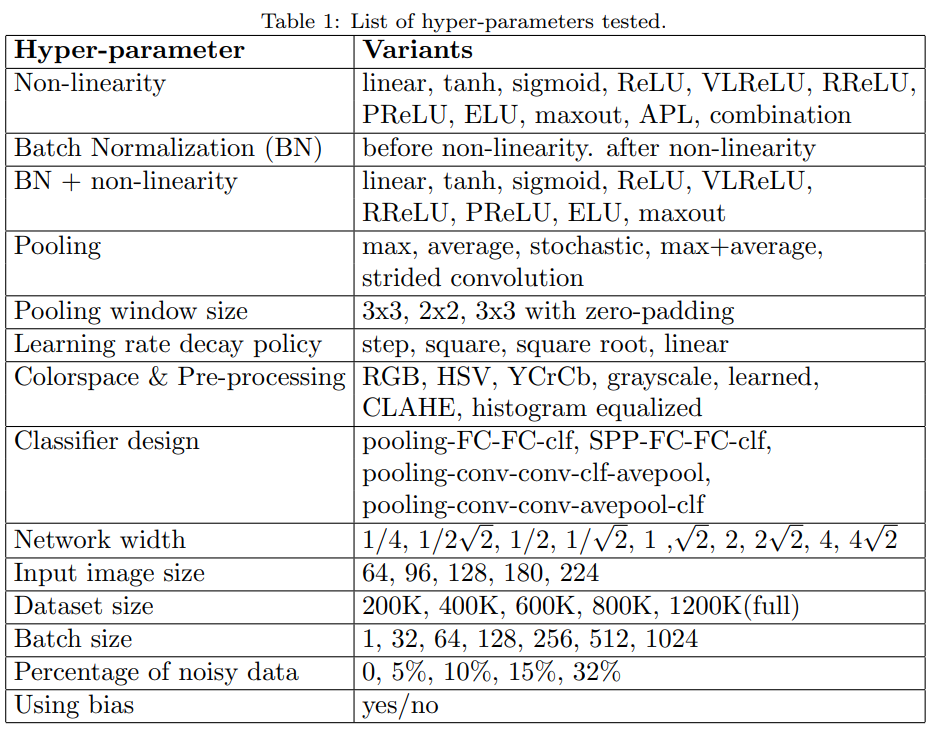

# Systematic evaluation of CNN advances on the ImageNet

## Abstract

+ The evalution tests the influence:
    - non-linearity (ReLU, ELU, maxout, compatability with batch normalization)
    - pooling variants (stochastic, max, average, mixed)
    - network width
    - classifier design (convolutional, fully-connected, SPP)
    - image pre-processing
    - learning parameters: learning rate, batch size 
    - ...

## 2. Evaluation

### 2.1

+ List of hyper parameters tested

    