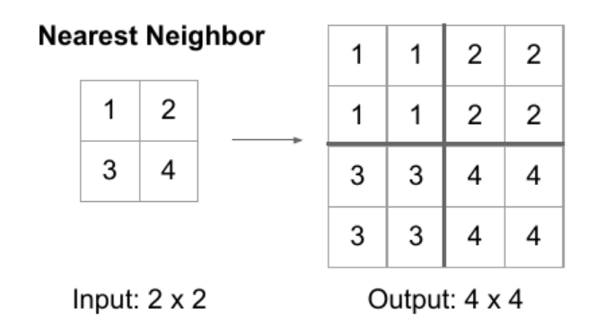
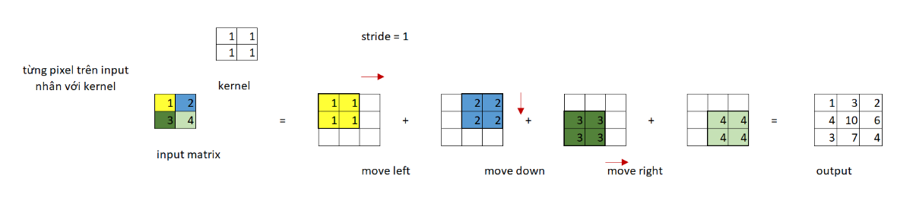

# Các thành phần trong mạng U-Net 

## Up-sampling (Nearst Neighbors)
+ Kĩ thuật giúp tăng kích thước output trong mạng CNN.

## Transposed Convolution - Tích chập chuyển vị 
+ Dạng tích chập giúp tăng kích thước của mạng CNN. Giả sử, thực hiện trên ma trận đầu vào kích thước 2x2.
    - Thực hiện nhân tích chập ma trận đầu vào với chính nó được ma trận kết quả tương ứng với vị trí điểm ảnh {a11, a12, a21, a22}
    - Cộng tổng các ma trận 

## Deconcolutional Neural Network 

## Receptive Field 

## Dilation Matrix 