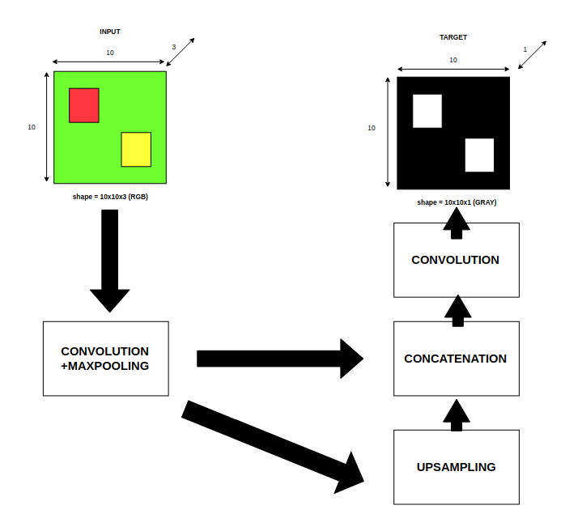
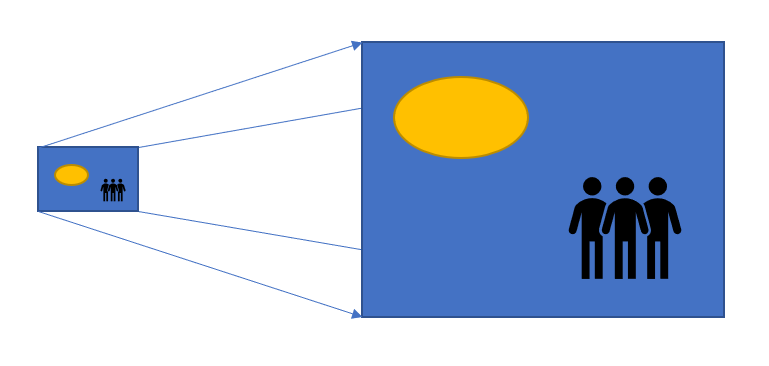
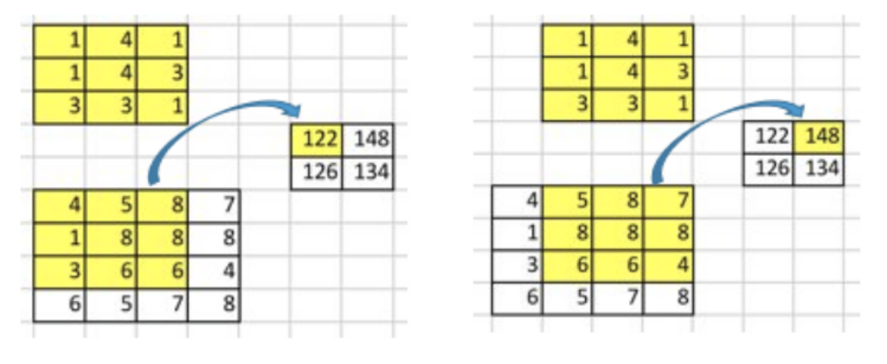
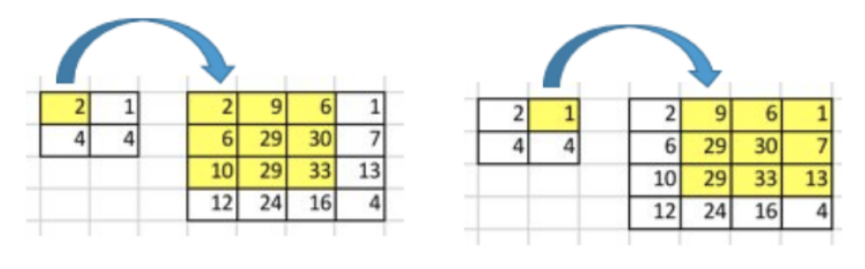
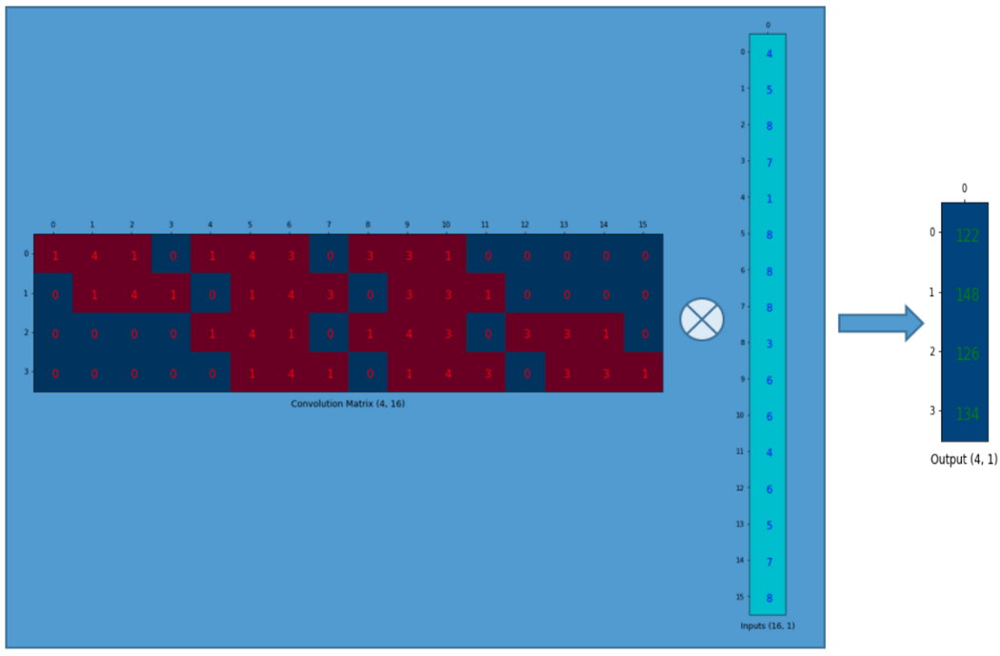
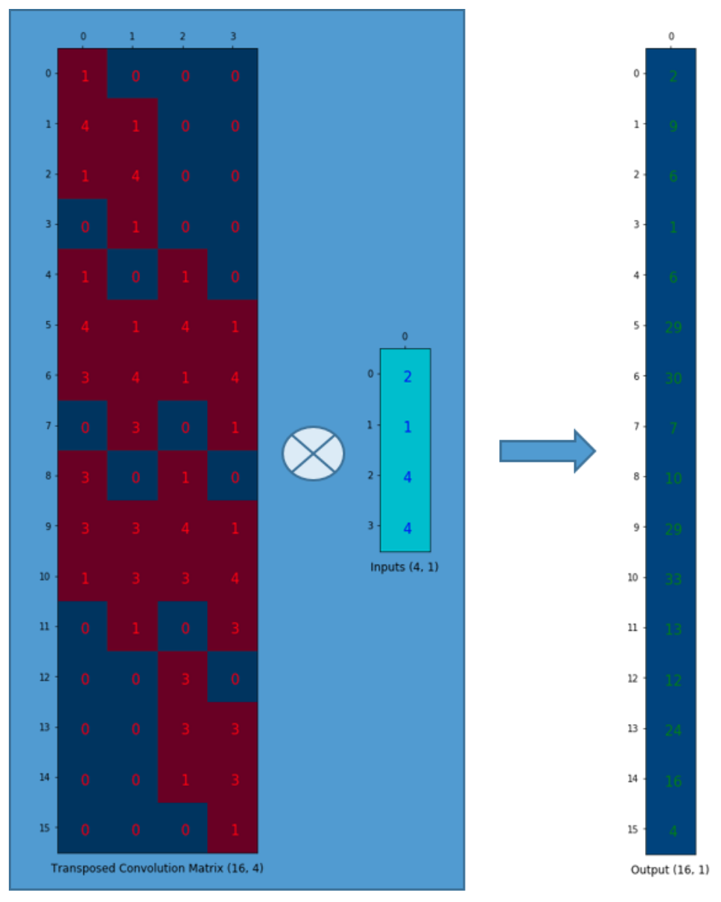
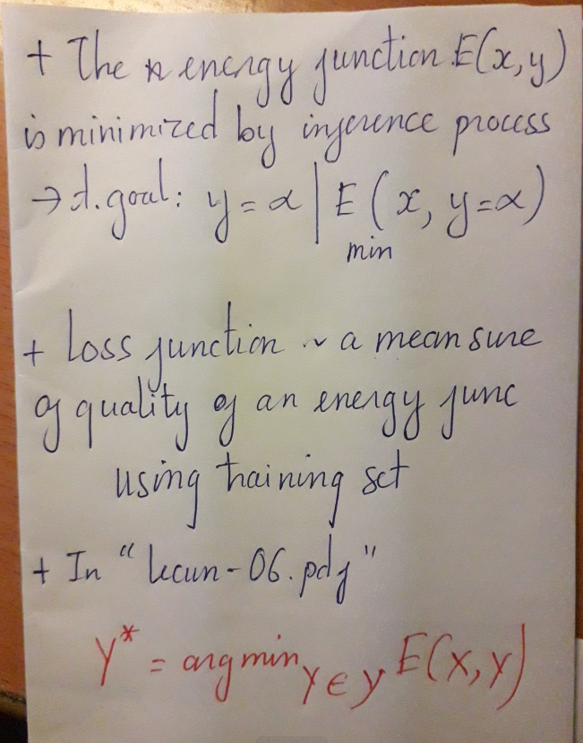
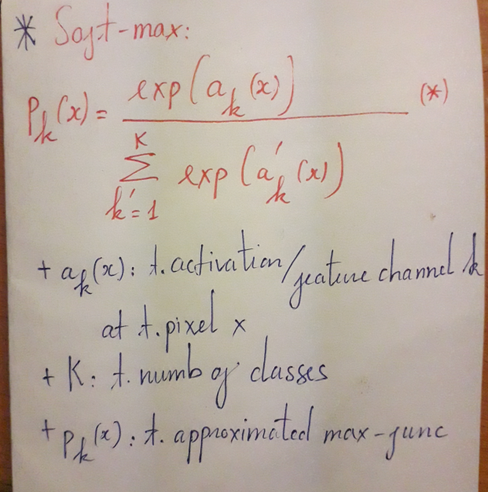
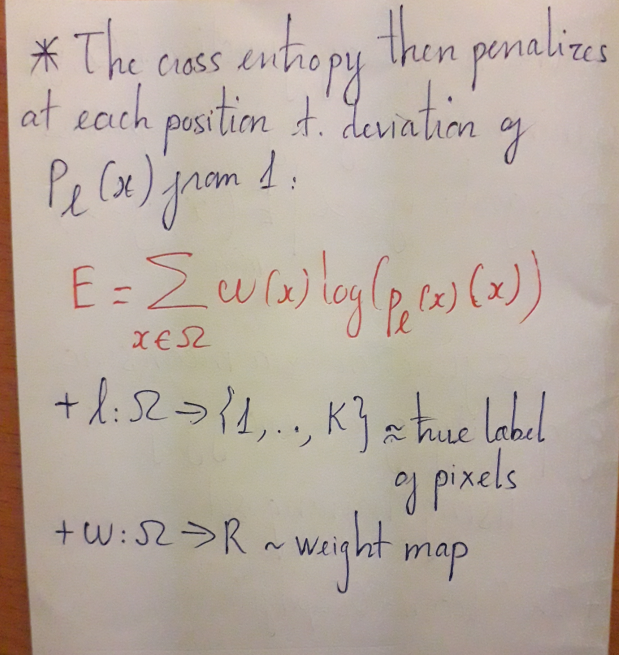

# U-Net: Convolutional Networks for Biomedical Image Segmentation

## 0. Abstract

+ The architecture consists:

    - A **contracting path** to capture context

    - A symmetric **expanding path** that enables precise localization. *Connect features*.

+ ? **Padding method**

## 1. Introduction

+ Phương pháp trước đó, sử dụng 1 cửa sổ trượt (sliding-window) nhằm phân loại label trên từng điểm pixel. Nhược điểm:

    - Chậm do network chạy riêng lẻ trên mỗi phần nhỏ của ảnh đầu vào & việc xử lý lại vùng. 

    - Sự đánh đổi giữa độ chính xác cục bộ & nội dung toàn bộ của thông tin bức tranh. 

+ Phương pháp đề xuất, sử dụng 2 thành phần của kiến trúc mạng:

    - 1 phần 

+ Important modification:

    - *In upsampling part*

## 2. Network Architecture

+ Consists:

    - a contracting path (CNN)

    - an expansive path ()

+ Network flow:

### 2.1 Contracting path

+ 2 x [Convolutions (3x3) -> ReLU -> MaxPooling (stride=2)]

    - 572x572 -> 570x570 -> 568x568 => padding=1

+ Each down-sampling: halves down size of image

    - MaxPooling (kernel_size=2)

### 2.2 Expansive path

+ An up-sampling of the feature map: convolutions (2x2) ~ *up-sampling with transposed-convolution*

    - Halves the number of feature channels

+ A concatenation 

+ 2 x [Convolution (3x3) -> ReLU]

+ Final layer: 1 x Convolution (1x1)

=> [transpose_conv -> concate -> 2 x conv (3x3) - > relu]

#### 2.2.1 Up-sampling with transposed-convolution

+ Up-sampling to convert from low to high resolution. Various methods to conduct up-sampling:

    - Nearest neighbor interpolation (noi suy)

    - Bi-linear interpolation

    - Bi-cubic interpolation

+ Transposed Convolution:

    - To extract features in the encoder & restores the original image size in the decoder.

+ Convolution operation forms a **many-to-one relationship**

+ With **Backward** to find associate 1 value in a matrix to 9 values in another matrix.

    - *one-to-many relationship* ~ core idea of **transposed convolution**

+ Convolution Matrix *(4x4)->(2x2)*

    - Ảnh đầu vào được *flatten*: **(a*a) -> (a*a, 1)** 

    - Sắp xếp lại ma trận kernel sao cho mỗi hàng được ghép bởi các hàng của ma trận kernel & ngăn cách nhau bởi *'0'*

    -> thực hiện nhân ma trận: **convolution_matrix * input_matrix** 

+ Transposed convolution matrix *(2x2)->(4x4)*:

    - Step by step:

        - Convolution matrix (4x16) **be transposed** to Convolution transpose matrix (16x4)

        - Convolution Transpose matrix (16x4) * Column vector (4x1) => output matrix (16x1) 

## 3. Training

+ Using **Stochastic Gradient Descent (SGD)**

