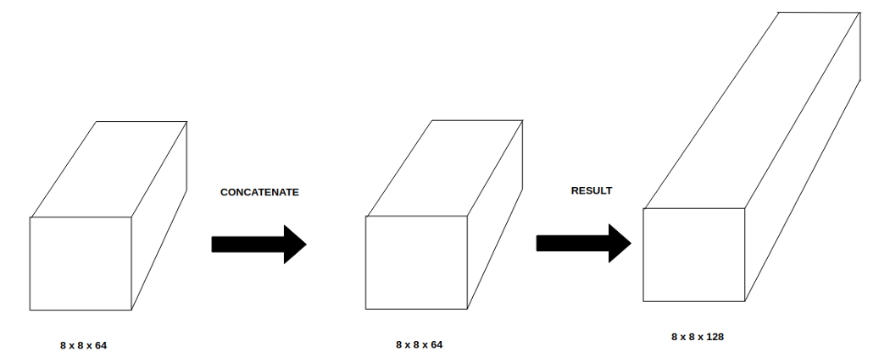

+ Encoder: (CNN)
    - giam chieu rong & dai image by using conv & pooling

+ Decoder: (FCN)
    - phuc hoi kich thuoc anh ban dau 
    - FCN 8, 16, 32

+ What is the difference between upsampling and bi-linear upsampling in a CNN?

    - Upsampling: increasing the size of an image

    - Upsampling techniques:

        - Nearest-Neighbor: copies the value from nearest pixel's value

        - Bilinear: Uses all nearby pixels to calculate the pixel's value. Using **linear interpolations**

        - Bicubic: Same *Bilinear* but using **polynomial interpolations**

    - Details:

        - https://datascience.stackexchange.com/questions/38118/what-is-the-difference-between-upsampling-and-bi-linear-upsampling-in-a-cnn

+ Classmethod & Staticmethod in Python

    - *@classmethod*


+ **Calculated network size**:

    - Convolution + MaxPooling:

        - Output size: **output_width x output_height x numb_filters**
        
        ```
        output_width = (W - F_w + 2*P)/S_w + 1

        - W: width 
        - F_w & F_h: kernel shape
        - P: padding
        - S: stride
        - f: Number of filters
        ```

    - Upsampling:

        - Nearest-Neighbor:
            ```
            output_size = input_size + 2
            ```

        - Bilinear with *scale_factor = a*:
            ```
            output_size = input_size*2
            ```
        
    - Concatenation:

        - https://medium.com/@bond.kirill.alexandrovich/understanding-unet-27de538e08d8

        - it's made by **third** axis (depth)

        - input_w (=output_w) x input_h (=output_h) x input_depth (=**2*output_depth**)




+ **Preprocess:**

    -  Maximally stabe extremal regions (MSER)

    - Hàm cross entropy: CE(pt) = -log(pt).

    - focal loss: FC(pt) = -(1-pt)^alpha*log(pt)

        - FC sẽ giúp cho các quan sát khó dự báo tác động đến loss function thấp hơn so với CE

        - alpha-balanced Focal loss: FC(pt)=-alpha*(1-pt)^gamma*log(pt).

    - dice loss & focal loss 

        - focal loss: điều chỉnh để loss function của các TH phân loại kém chính xác thấp hơn

            - alpha: ti le background & foreground

    - https://github.com/mrgloom/awesome-semantic-segmentation?fbclid=IwAR0ibCIJ_UQmGUjK9QwFuOXUnykbkQrYXqdNSxRrXep057J0FAOtE-W_xXU

+ [batch_size, h, w]

+ ? fp16 on usual GPUs, it is much slower on them (basically on everything except Teslas). Also, it is usually fine for inference but while training we still need fp32 precision

- https://on-demand.gputechconf.com/gtc/2017/presentation/s7310-8-bit-inference-with-tensorrt.pdf

- https://github.com/suvojit-0x55aa/mixed-precision-pytorch

- https://www.kaggle.com/c/carvana-image-masking-challenge/discussion/37415


+ Lung nodule detection
    * cross-validation
    * cross entropy and focal loss
    * re-evaluating weight balance between true positive and false positive.
    * Study RandAugment paper, but using different policy (I can't point exactly what is it, but key work is bayesian optimization RL) with medical
    * differenct networks (unet, densenet, ...)
    * Ensemble 5 models together when inference (easy with triton inference server)

    - miss another paper, "3D Anisotropic Hybrid Network: Transferring Convolutional Features from 2D", in 12 types of nodule it gets the best result in 6. but implement it b**s## event author release code but not all the tricks they mentioned in the paper. Extract weight in 2d then assign in 3d in encoder, try different depth of PFN in decoder. So read the paper carefully and implement, dont read their code.