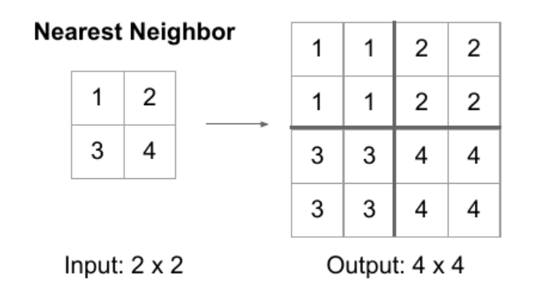
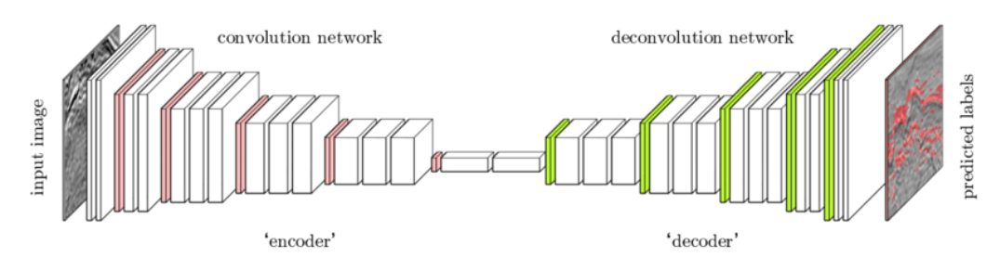
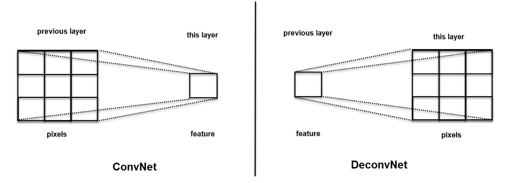
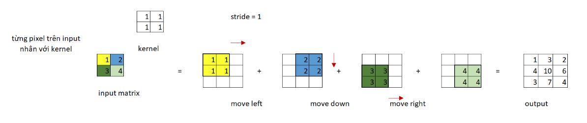
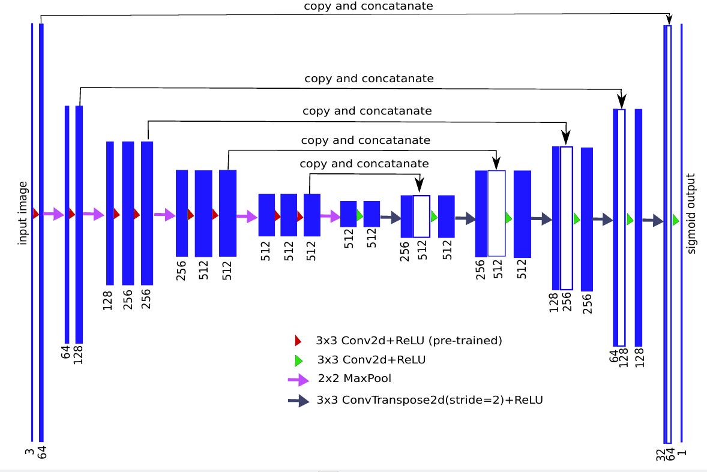
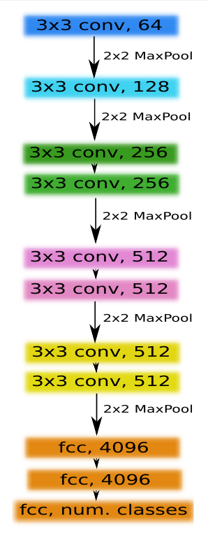

# TernausNet: U-Net with VGG Encoder Pre-Trained on ImageNet for ImageSegmentation

## I.Các kiến thức cần làm rõ 

###  1. Các thành phần trong mạng U-Net 

### 1.1 Upsampling
+ Upsampling: kĩ thuật giúp tăng kích thước output trong mạng CNN. 
+ Upsampling 2d layer: có thể hiểu tương tự với hàm *resize()*, nhưng cho ra output có kích thước lớn hơn bằng cách coppy các điểm ảnh gần kề.
    
+ Một vài kĩ thuật upsampling khác như:
    - Bilinear interpolation: biến đổi tuyến tính nội suy tất cả các điểm ảnh.

### 1.2 Mạng giả tích chập (Deconvolutional Neural Network)
+ Nếu như mạng CNN có nhiệm vụ extract ra feature maps. Mạng giả tích chập có khả năng chuyển từ feature map trả về ảnh. 
+ Mạng giả tích chập có kích thước các layer tăng dần. Các layer trong mạng sẽ giải mã đặc trưng thành thông tin từng điểm ảnh của ảnh output.

    

+ Quay lại với mạng U-Net, nhánh bên trái có nhiệm vụ phân tách đặc trưng từ ảnh đầu vào, nhánh bên phải có nhiệm vụ khôi phục ảnh đầu ra.

### 1.3 Transposed Convolutional (tích chập chuyển vị)
+ Tích chập chuyển vị có thể coi như quá trình ngược của tích chập thông thường. Thay vì mỗi features mapping sang pixels ảnh thì ngược lại từ pixels ảnh sang feature.

    

+ Minh họa sự hoạt động của tích chập chuyển vị:
    
    
### 2. Ảnh hưởng của việc sử dụng Initialize Weights

#### 2.1 Tầm quan trọng của việc khởi tạo trọng số 
+ Giúp ngăn chặn hàm kích hoạt của lớp xảy ra hiện tượng *exploding & vanishing gradient*.
+ Giúp cải thiện việc tối ưu thuật toán
+ Tăng tốc độ hội tụ mô hình.

#### 2.2 Một vài lưu ý khi khởi tạo trọng số 
+ Không khởi tạo toàn bộ trọng số có giá trị 0 hoặc cùng một giá trị
+ Không khởi tạo trọng số quá lớn vì có thể xảy ra hiện tượng bão hòa (*Saturation problem*) từ đó dẫn đến suy hao đạo hàm (*Vanishing Gradient*).
    - Vanishing gradient: xảy ra khi giá trị gradient nhỏ dần đều (becomes close to zeros) qua mỗi lần tính backpropagation. Độ thay đổi của weights không đáng kể -> mô hình k hội tụ được. [Link tham khảo thêm](https://towardsdatascience.com/the-vanishing-gradient-problem-69bf08b15484)
+ Mình có viết một bài chi tiết hơn về **Initializer Weights** [tại đây](https://github.com/Doan-Nguyen/Deep_Learning_Notes/tree/master/Topics/Initialize_Weights).

## II. Explain paper 

### 1. Abstract

+ Mạng U-Net truyền thống được cấu tạo bởi 2 thành phần:
    - Encoders 
    - Decoders 
+ Mạng neural network sử dụng trọng số từ các pre-trained model đã được học từ các tập dữ liệu lớn như ImageNet sẽ đem lại kết kết quả khả tốt hơn việc cho model học từ đầu trên các tập dữ liệu nhỏ. 

### 2. Introduction

+ Bài toán image segmentation thực hiện việc phân loại các vùng ảnh ở cấp độ pixel. Bài toán này thời gian gần đây được đưa vào xử lý ảnh trong y tế, nên đòi hỏi độ chính xác rất cao. 

+ Phương pháp được đề xuất gần đây là sử dụng 1 mạng CNN có thể thực hiện việc segmentation vùng ảnh từ ảnh đầu vào. 
    - Fully Convolutional Networks (FCN).
        - Thay thế lớp fully connected layers bằng lớp conv(1x1), chuyển từ đầu ra là classification score sang spatial [feature maps](http://kaiminghe.com/iccv15tutorial/iccv2015_tutorial_convolutional_feature_maps_kaiminghe.pdf).
            - Feature maps = features (shaped) + locations 

+ U-Net sử dụng [*skip connections*](https://theaisummer.com/skip-connections/).

### 3. Network Architecture 

#### 3.1 U-Net
+ U-Net gồm 2 phần chính + 1 phần phụ:
    - Phần kết nối 
    - Phần mở rộng 
    - Phần đáy chữ U (Bottleneck)

+ Phần thu hẹp (*contracting path/down sampling path (Encoder path)*):
    - Có kiến trúc giống các mạng CNN phổ biến, gồm 4 blocks. Thành phần mỗi block:
        - [2*conv_layer1(3x3, batch_norm) -> ReLU -> max_pooling(2x2) -> downsample (dropout)]
    - Số lượng của feature maps sẽ tăng đôi sau mỗi pooling:
        - 64 -> 128 -> 256 -> 512 

+ Phần mở rộng (*Expansion path/up sampling path (Decoder path)*):
    - Có kiến trúc gồm 4 blocks, thành phần mỗi block:
        - [conv2d_transpose(stride=2) -> concatenation {feature_map vs transposed_conv_layer} -> 2*conv_layer1(3x3, batch_norm) -> ReLU]

+ Phần đáy chữ U (Bottleneck):
    - Thành phần:
        - [conv_layer1(batch_norm) -> conv_layer2(batch_norm) -> dropout(0.3)]

+ Kiến trúc mạng U-Net với VGG-11 đảm nhiệm vai trò encoder:

+ Một bài viết chi tiết về việc xây dựng U-Net. [Link](https://medium.com/datadriveninvestor/an-overview-on-u-net-architecture-d6caabf7caa4)

#### 3.2 Encoder 
+ Tác giả đã thay đổi kiến trúc mạng VGG-11 để đảm nhiệm vai trò Encoder:
    - Loại bỏ toàn bộ các lớp *fully-connected layers* & thay thế bởi 1 *conv layer(512 channels)*. Lớp *conv layer(512 channels)* này đóng vai trò như phần đáy trong kiến trúc mạng mới.
    - Kết nối các *conv_layer* ở phần encoder với 

+ Các lớp được kế thừa từ pre-trained VGG-11 sẽ đứng xen kẽ các lớp được kết nối với decoder bằng cơ chế *skip connection*. 

#### 3.2 Decoder
+ Phạm vi của một khối decoder block:
    - [ConvTranspose2d -> conv(2x2)]
+ Cách tính các tham số  thành phần của 1 block decoder(in_channels, mid_channels, out_channels):
    - in_channels: tổng 2 conv_channels trong khối con2d_transpose
    - mid_channels: conv_channels của conv(3x3)
    - out_channels: conv_channels của conv_layers đầu tiên trong khối con2d_transpose kế tiếp 
+ Concatenate: Nối 2 lớp trong mạng UNet
    - torch.cat([input, output], 1)
        - input: ConvTranspose2d layer 
        - output: in encoder

### 4. Tính toán hàm mất mát 
+ Trước khi đi sâu về mặt toán học của các hàm mất mát, chúng ta nên tìm hiểu về dạng dữ liệu thường sử dụng trong bài toán Segmentation thường xuất hiện trong các cuộc thi trên Kaggle - **Run Length Encode**. Trong thực tế, sau khi thực hiện gán nhãn thủ công cho các dự án, ta nên convert dữ liệu gán nhãn dạng ảnh sang dạng RLE (dạng file .csv).
+ Mình có viết 1 bài chi tiết về  dạng dữ liệu RLE tại [đây](https://github.com/Doan-Nguyen/Deep_Learning_Notes/blob/master/RunLengthEncoder.md)

## III. Tài liệu tham khảo

1. [Image Segmentation](https://phamdinhkhanh.github.io/)
2. [What is skip architecture in CNN?](https://www.quora.com/What-is-skip-architecture-in-CNN)
3. [UNet — Line by Line Explanation](https://towardsdatascience.com/unet-line-by-line-explanation-9b191c76baf5)