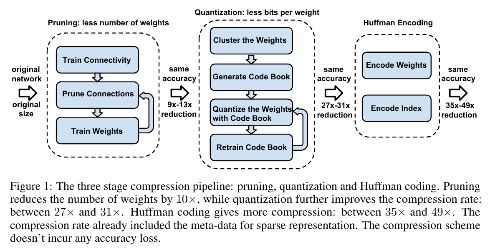

# [Review] Deep Compression: Compressing Deep Neural Networks With Pruning, Trained Quantization And Huffman Coding

## Abstract 

+ Tác giả đề cập đến khó khăn triển khai Neural Networks trên một hệ thống nhúng do sự giới hạn về sức mạnh phần cứng. Giải pháp đưa ra "deep compression" với 3 phương pháp chính:
    - **Pruning**: chỉ học các *connection* quan trọng
    - **Trained quantization**: lượng tử hóa trọng số (weights) để giảm tải trong quá trình chia sẻ trọng số (weight sharing)
        - Weight sharing: sử dụng chung cùng 1 weight vector để thực hiện cho tất cả các hoạt động "convolution".  
        - [weight_sharing](https://www.quora.com/What-exactly-is-meant-by-shared-weights-in-convolutional-neural-network)
    - **Huffman coding** 

## 1.Giới thiệu chung 

+ Tác gỉa đề cập đến các ứng dụng trên mobile của Facebook, Baidu ... giải quyết được nhiều vấn đề như tăng cường tính riêng, xử lý realtime, giảm tốc độ truyền (bandwidth) trong mạng
    - Network bandwidth: tốc độ xử lý dữ liệu giữa inputs & weights
    - [network_bandwidth](https://medium.com/@culurciello/computation-and-memory-bandwidth-in-deep-neural-networks-16cbac63ebd5) 

+ Mô tả sơ đồ hoạt động & hiệu quả cải thiện của các phương pháp:

    

+ Hiện tại, do nhu cầu bản thân, mình sẽ tìm hiểu về phương pháp **pruning model** trước.  

## 2. Network Pruning

+ Các bước thực hiện:
    - First step: Learning the connectivity via normal network training.
    - Second step: tỉa những kết nối của các trọng số nhỏ. Nguyên tắc: 
        - Loại bỏ các trọng số  (weights) dưới mức ngưỡng **threshold**.
    - Third step: học lại mô hình với các weights sau khi loại bỏ bớt các kết nối thưa thớt ở bước 2.

