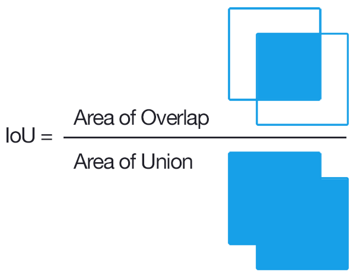
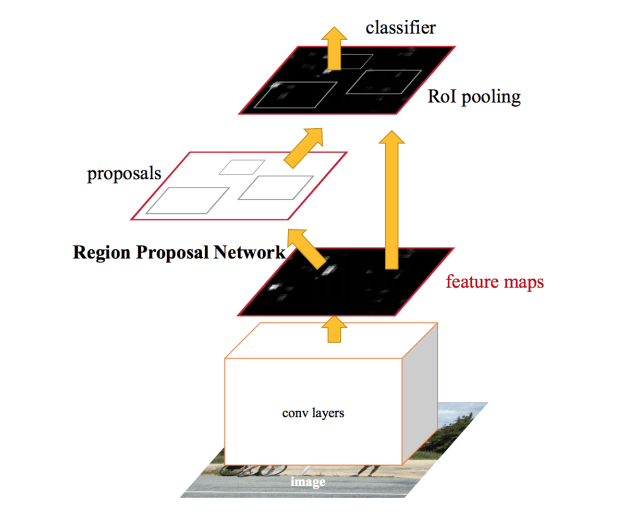

# Detecting Text in Natural Image with Connectionist Text Proposal Network
[link paper](https://arxiv.org/pdf/1609.03605v1.pdf)

## 0. Giải thích các khái niệm 
Trong phần này, chúng ta sẽ đi tìm hiểu các khái niệm xuất hiện trong bài báo đề hiểu rõ hơn về bài báo.

### 0.2 Anchor mechanism & an anchor regression mechanism
+  Giả sử xét bài toán object detection, mạng neural sẽ đưa ra nhiều dự đoán về vị trí của object dưới dạng các *bouding boxes* hay còn được gọi **region proposal**. Với mỗi anchor box, người ta có thể phân loại thành 2 nhóm *negative* hoặc *positive* thông qua hệ số *Intersection Over Union*. Ngưỡng thường được sử dụng đề xác định là 0.5.

+ Cải thiện *anchor box*:
    - Rõ ràng kích thước các object cần detect không cố định. Trước khi đi vào training model, ta cần xác định kích thước lớn nhất & nhỏ nhất của bounding boxes từ tập training datasets.
    - Ta có thể sử dụng *k-mean* để ước lượng các bounding boxes. Bạn có thể đọc thêm bài báo [MetaAnchor: Learning to Detect Objects with Customized Anchors](https://arxiv.org/pdf/1807.00980.pdf) 

### 0.1 Region Proposal Network (RPN8)
+ Xuất hiện lần đầu trong bài báo [Faster RCNN](https://arxiv.org/abs/1506.01497). Tóm gọn về thuật toán *Faster R-CNN*, thay vì sử dụng thuật toán *selective search* người ta sử dụng mạng *Region Proposal Network* đề tìm *region proposal*. 

### 0.4 Recurrent Neural Network 

### 0.3 Bi-directional LSTM 

### 0.5 Fine-Scale Proposals
+ Hiểu ở đây, tác giả chia text thành nhiều vùng nhỏ có khả năng chứa kí tự. Từ các vùng này sẽ được *dự đoán* khả năng chứa kí tự ở bước *Detecting Text in Fine-Scale Proposals* sau đó được kết nối ở bước *Recurrent Connectionist Text Proposals*.

## 1. Phân tích bài báo

### 1.1 Các vấn đề của bài toán Text Detection 
+ Khác với bài toán Object detection thông thường, việc xác định vị trí text trong tự nhiên gặp nhiều vấn đề như sự phức tạp của background, nhiễu trong ảnh, sự đa dạng về kich thước của text. Ngoài ra, khoảng cách giữa các kí tự cũng là khó khăn lớn. Các bounding boxes không bao quát đủ thông tin của text dẫn đến hiện tượng mất mát thông tin. (phù)

### 1.2 Các giải pháp trước đó 

### 1.3 Các đề xuất của bài báo

+ Bài báo đề xuất **Connectionist Text Proposal Network** nhằm xác định vị trí *chuỗi* text. Các bước xử lý trong thuật toán:
    - Step 1: Xác định vị trí của chuỗi các kí tự. 
        - Tác giả sử dụng cơ chế hồi quy anchor boxes (an anchor regression mechanism) để dự đoán vị trí theo chiều nằm ngang và xác suất tồn tại của kí tự (được đo lường text/non-text score) của mỗi vùng *text proposal*.  Ở đây, tác giả sử dụng mạng **Region Proposal Network** để đưa ra các dự đoán.
    - Step 2: Kết nối chuỗi các kí tự được đề suất
        - Tác giả sử dụng cơ chế mạng neron hồi tiếp (an in-network recurrence machanism) để nối các chuỗi text proposals từ feature maps.
    - Step 3: Tích hợp hai cơ chế 
        - Kết quả của 2 cơ chế trên có thể detect được các chuỗi kí tự có sự đa dạng về kích thước. 

## 2. Phân tích các đề xuất (~ Contributions)

+ **Connectionist Text Proposal Network (CTPN)** gồm 3 quá trình chính:
    - Detecting text in fine scale proposals 
    - Recurrent connectionist text proposal 
    - Side-refinement.

### 2.1 Detecting Text in Fine-Scale Proposals 

### 2.2 Recurrent Connectionist Text Proposals

### 2.3 Side-Refinement

## 3. Thực thi bài báo 

## 4. Đánh giá 

## 5. Tham khảo 

[Anchor Boxes — The key to quality object detection](https://medium.com/@andersasac/anchor-boxes-the-key-to-quality-object-detection-ddf9d612d4f9)

