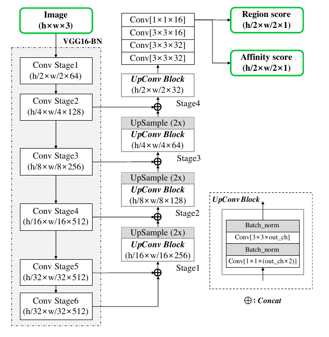

# Character Region Awareness for Text Detection 

## 0. Các khái niệm cần làm rõ 

Mình có viết các nội dung cần làm rõ hơn trong paper ở [đây](https://github.com/Doan-Nguyen/Self_Learning/blob/master/Research_Papers/Self_Reproduce/Text_Detection/Papers/CharacterRegionAwarenessForTextDetection/Sub_topics.md).

## 1. Tóm tắt nội dung 

### Các phương pháp đã xuất hiện 

### Tư tưởng chính 

+ *Text detection* là bài toán không mới. Các phương pháp xuất hiện trước đó thường detect ở cấp độ *từ* bằng bounding boxes, hạn chế cách tiếp cận này đến từ sự đa dạng về kích thước hoặc các từ có kích thước quá chênh lệch đặt sát nhau.
+ Ý tưởng của bài báo này là detect từng chữ cái & kết nối các chữ cái có tính *tương đồng* thành một từ. Tính tương đồng này được dự đoán bằng "affinity score", một trong hai tham số đầu ra của mô hình (*region score* & *affinity score*). Bên cạnh đó, vấn đề về dữ liệu gán nhãn cho từng chữ cái được giải quyết bằng **weakly supervised learning framework**. 

### Kiến trúc mô hình 

+ Mạng *fully convolutional network* tương đương *VGG16* sử dụng *Batch Normalization* làm phần encoder như trong kiến trúc mạng U-Net.

+ Thành phần kiến trúc mạng:
    - VGG16_BatchNormlization đảm nhiệm vai trò như Encoder
    - Các phần ConvStage trong VGG16_BN được kết nối với nhau hoặc với Upsample bằng **concat** để tạo nên Upsample phía trên.
    - Upsample cuối cùng kết nối với một khối 4 Conv để 
 

## 2. BenchMark 

## Tham khảo 
[Intuitive Explanation of Skip Connections in Deep Learning ](https://theaisummer.com/skip-connections/)

[Weak Supervision: A New Programming Paradigm for Machine Learning](http://ai.stanford.edu/blog/weak-supervision/)