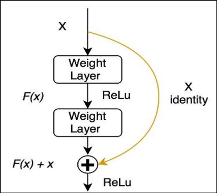

## 0. Các khái niệm cần làm rõ 

### 0.1 Skip connections
+ Skip connections ra đời để khắc phục hiện tượng *vanishing gradient descent* trong các mạng Neural Network. Những chức năng có thể sử dụng *skip connections*:
    - **[ResNet](https://arxiv.org/abs/1512.03385)** skip connections via addition
    - **DenseNet** skip connections via concatenation
    - **U-Nets** long skip connections

+ Tác dụng của skip connections:
    - Cho phép các lớp phía sau có thể học được các đặc trưng từ các lớp đầu. Từ đó giảm thiểu việc mất mát thông tin từ các lớp đầu.
    - Tránh hiện tượng *vanishing gradient descent*.

+ Để tránh loãng nội dung paper, mình xin dừng viết skip connections tại đây. Các bạn có thể đọc thêm tại [đây](https://theaisummer.com/skip-connections/) 

### 0.2 Batch normalization

+ Lý do cần sử dụng *batch normalization*
- Chúng ta normalize (chuẩn hóa) đầu vào bằng hàm kích hoạt (vd: sigmoid: [-1, 1]; ReLU [0, 1]), từ đó các giá trị đầu vào sẽ ổn định kéo theo sự ổn định của đạo hàm. Ngoài ra, normalize còn khắc phục vanishing/exploding gradient, tăng tốc độ hội tụ.

+ **Covariance Shift**
- mean và variance sẽ bị lệch đi so với ban đầu

#### 0.2.1 Regularization

### 0.3 Weakly-supervised learning
+ Weak supervision ra đời để giải quyết vấn đề gán nhãn dư liệu, cụ thể là dữ liệu gán nhãn k chính xác (supervision with noisy labels). Sự không chính xác này có thể do 2 nguyên nhân:
    - Quá trình gán nhãn dữ liệu có sai sót (noisy labels).
    - Việc phân loại nhãn dữ liệu k chính xác

+ Tiện thể nhắc lại các loại thuật toán trong ML dựa theo phương thức học:
    - Supervised Learning (Học có giám sát)
        - Nhận diện: Dự đoán đầu ra dựa vào *dữ liệu đã biết trước* (dữ liệu, nhãn)
        - Thành phần:
            - Classification
            - Regression
    - Unsupervised Learning (Học không giám sát)
        - Nhận diện: Không biết nhãn mà chỉ có dữ liệu đầu vào.
        - Thành phần:
            - Clustering (phân nhóm)
    - Semi-supervised learning (Học bán giám sát) 
        - Có 1 lượng lớn dữ liệu nhưng chỉ có 1 lượng nhỏ nhãn.

+ Phần này mình sẽ dừng ở đây, nếu bạn muốn tìm hiểu thêm tại [đây](https://academic.oup.com/nsr/article/5/1/44/4093912)

### 0.4 Single bounding box

### 0.5 Heatmaps predicted

### 0.6 Gaussian heat-map/Gaussian distribution value

### 0.7 Watershed algorithm
