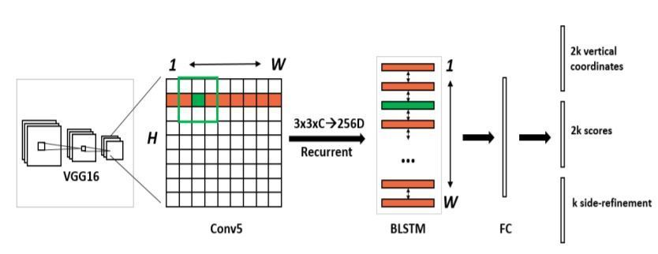
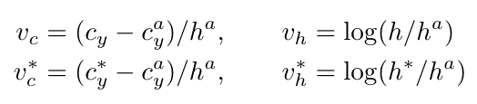
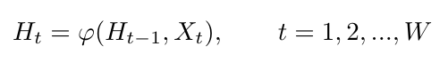
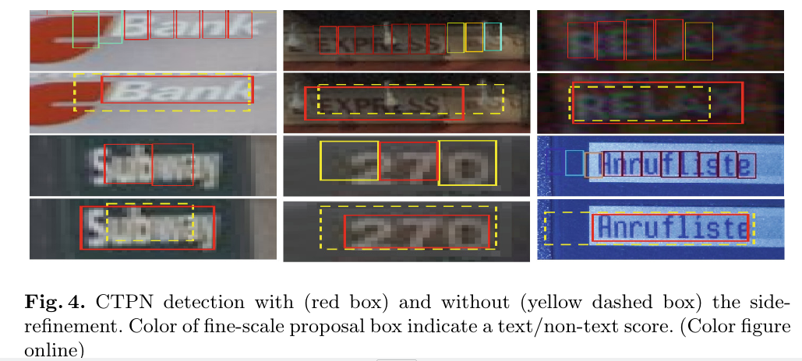
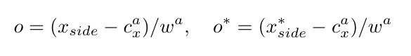
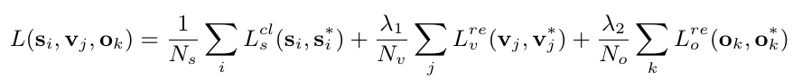

# Detecting Text in Natural Image with Connectionist Text Proposal Network

## Sơ lược về thuật toán 
+ Ý tưởng chính của thuật toán chia nhỏ thành nhiều phần & dự đoán khả năng xuất hiện text trong từng phần. Từ các phần được dự đoán chứa text sẽ kết nối chúng lại thành 1 dòng. 

+ Xác định vị trí line text dựa trên feature maps. Ở đây, tác giả coi dòng text cần xác định như chuỗi các *fine-scale text proposal*, với mỗi proposal dự đoán các thành phần của dòng text đó.

+ Sử dụng cơ chế "vertical anchor" để dự đoán 2 yếu tố: *ví trí* & *khả năng tồn tại của text* trong mỗi proposal cố định về chiều rộng. Các dãy/chuỗi proposals được nối bởi mạng hồi tiếp (RNN).

## 1.Introduction

+ Architecture of the CTPN

    

    - VGG16 ~> feature maps

    - Bi-directional LSTM (~ the sequential windows)

        - RNN layer is connected to a 512D fully-connected layer => predicts: text/non-text scores; y-axis coordinates; side-refinement offsets of *k* anchor.

### 1.1 Contributions
+ Bước 1: Xác định vị trí text từ chuỗi *fine-scale text proposals*. 
    - Sử dụng *Region Proposal Network* để tìm ra các text proposals (region proposals) nằm trên feature map. 
    - CTPN sử dụng *k-anchor* để dự đoán thông tin về vị trí + khả năng chứa text với mỗi text proposal.
+ Bước 2: Kết nối các chuỗi text proposals
    - Bài báo sử dụng mạng hồi tiếp để kết nối thành chuỗi các text proposals.
+ Bước 3: Sàng lọc biên (side-refinement)
    - Tích hợp 2 bước trên thu được mô hình end-to-end.

## 2. Connectionist Text Proposal Network

### 2.1 Detecting text in Fine-Scale Proposals

+ Ý tưởng:
    - Sử dụng một mạng CNN để phân tích ra feature maps.
    - Sử dụng một densely sliding trượt trên feature maps => chuỗi text fine-scale proposals từ feature maps.
        - *fine-scale*: các ô proposals bị cố định chiều rộng 16-pixels, còn chiều cao thay đổi.

+ Phương thức:
    - Sử dụng pretrain-vgg16 để  extract ra feature maps.
    - Sử dụng sliding window (3x3) trượt trên lớp conv thứ 5 của mạng VGG-16.
        - Kích thước lớp conv thứ 5 được xác định theo kích thước ảnh đầu vào. Xem ví dụ về cách tính [Link]()
        - Tổng strides là 16, receptive field là 228 được thiết lập trong kiến trúc mạng. (?)
    - Sử dụng cơ chế *anchor regression* cho phép *Region Proposals Network* detect được các objects có kích thước đa dạng:
        - Với việc sử dụng số lượng anchors linh hoạt, một cửa sổ trượt có thể dự đoán nhiều objects với kích thước đa dạng.
        - Cơ chế *anchor regression* được đề xuất trong thuật toán Faster R-CNN.

+ **Vetical anchor regression**:
    - Kích thước/khoảng cách giữa các kí tự không cố định -> khó khăn trong việc xác định ví trí đầu & cuối của dòng text hoặc từ. Sử dụng *vertical (small) anchor* giúp hạn chế sai sót trong dự đoán line text.
    - Đưa ra 2 dự đoán:
        - Khả năng *fine-scale proposal* chứa text
        - Tạo độ trục y của mỗi *fine-scale proposal*

+ Thiết kế *fine-scale proposal*:
    - Ý tưởng:
        - Sử dụng *k* - vertical anchors để dự đoán tọa độ y cho mỗi proposal.
        - *k* - vertical anchors có chung kích thước chiều rộng là 16 pixels. Với mỗi anchors lại có 1 chiều cao khác nhau => *k* heights
        - Công thức tính *vertical coordinates* thông qua các *heights* & y-axis center:

            
        
        - Ngưỡng threshold cho xác suất chứa text của region proposal là 0.7 (text/non-text score).

### 2.2 Reccurrent Connectionist Text Proposals

+ Vấn đề
    - Việc chia nhỏ dòng text thành nhiều *text proposals* & dự đoán mỗi proposal có chứa text hay không có thể sai sót khi khoảng cách giữa các text xa hoặc nhầm lẫn với các đối tượng có cấu trúc *sequence* giống text.

+ **Ý tưởng** 
    - Bài báo sử dụng mạng hồi tiếp (RNN) để kết nối mỗi vùng *text proposal* như thành phần của từ. Ngoài ra, tác giả sử dụng Long-Short Term Memory để khắc phục sự phụ thuộc xa trong các từ của câu.

+ Thiết kế RNN layer trên conv-5:
    - Cập nhật hidden layer thứ *t*:

        

        - $X_t$: là vùng convolutional (*conv-5*) feature của cửa số trượt (3x3)
        - W: là chiều rộng của conv-5
        - $H_t$: là hidden state được tính toán từ $X_t$ & hidden state thứ *t-1* $H_t-1$ 
        - $\varphi$: hàm phi tuyến tính xác định form của mạng hồi tiếp.
    
    - Bài báo đề xuất sử dụng bi-direction LSTM:
        - Giúp mạng RNN mã hóa nội dung text theo 2 chiều. Ngoài ra còn hạn chế hiện tượng *vanishing gradient*
        - Tác giả sử dụng 128-D hidden layer cho mỗi LSTM -> kết quả: 256-D RNN hidden layer ($H_t \in R^256$)

### 2.3 Side-Refinement 

+ Vấn đề:
    - Như các phần trên, *fine-scale text proposals* + *RNN* có thể giải quyết tốt đối với *vertical anchors*. Đối với *horizontal direction*, nếu sử dụng chuỗi proposals rộng 16 pixels có thể không bao kín chính xác vùng text (các ảnh hàng thứ 2, 3, 4 trong hình)
    - Một trường hợp khác, khi chia ảnh thành nhiều proposals 16 pixels. Tránh khả năng mất mát 1 vùng nhỏ nhưng chứa text ở đầu của line text. Bài báo đề xuất phương pháp *sàng lọc biên - side-refinement* 

        

+ Ý tưởng:
    - Text line được kết nối từ các *text proposals* có text/non-text score > 0.7.

+ Quá trình xây dựng các text lines (bounding box):
    - Step 1: Xác định *Text proposal* hàng xóm:
        - Khoảng cách giữa 2 proposals phải nhỏ nhất
        - Khoảng cách này < 50 pixels.
        - Vectical overlap > 0.7
    - Step 2: Điều kiện 2 proposal boxes ghép cặp:
        - Cả 2 proposals đều thỏa mãn điều kiện hàng xóm của nhau.

+ Công thức tính toán phần bù ở 2 proposals biên:
    - Công thức tính offset:

        

        - $o$: offset
        - $x_side$: tọa độ dự đoán trục x của chiều ngang gần nhất với anchor hiện tại.
        - $x^{*}_side$: tọa độ lề ground truth theo trục x.
        - $c^{a}_x$: tâm anchor theo trục x.
        - $w^{a}$: chiều rộng của anchor

### 2.4 Model Outputs & Loss Function
+ Ý tưởng: 
    - Tổng hợp các phần trên, mô hình CTPN trả về (k- số lượng anchors):
        - Text/non-text score (**s**)
        - Vertical coordinates  (**v**)
        - Side-refinement offset (**o**)
    - Mỗi kết quả trả về tương đương với một loss function tương ứng. Loss của mô hình sẽ là tổng của 3 loss tương ứng với 3 kết quả đầu ra.
+ Tính toán:
    - Gọi $L^lc_s$, $L^re_v$, $L^re_o$ lần lượt là loss của text/non-text score, coordinate & side-refinement. Loss của mô hình $L$ sẽ trờ thành loss của multi-task. Công thức tính:
        

    - $i$: chỉ số của anchor
    - $s_i$: xác suất dự đoán của anchor thứ *i*
    - $s^*_j = {0, 1}$: ground truth
    

## Đánh giá quá trình phát triền
+ Quan điểm cá nhân chia các thuật toán Text Detection thành 2 nhóm:
    - Xác định text proposals bởi các mạng CNN sử dụng các bounding boxes như R-CNN với cơ chế **Region Proposal Network**.
        - Tốc độ xử lý nhanh.
    - Xác định text bởi phương pháp segmetation:
        - Coi chuỗi các kí tự là vùng cần segmentation: [PixelLink](https://arxiv.org/pdf/1801.01315.pdf), [Linking-Segments](https://arxiv.org/pdf/1703.06520.pdf)
        - Coi tâm kí tự là vùng segmentation: [CRAFT]()
        - Tốc độ xử lý chậm nhưng độ chính xác & giải quyết nhiều trường hợp phức tạp về vị trí/hình dạng hơn.