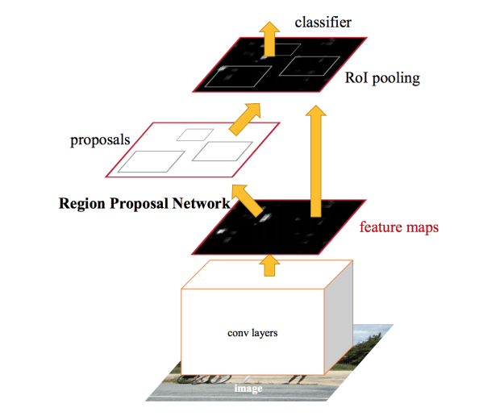

# Detecting Text in Natural Image with Connectionist Text Proposal Network
[link paper](https://arxiv.org/pdf/1609.03605v1.pdf)

## 0. Giải thích các khái niệm 
Trong phần này, chúng ta sẽ đi tìm hiểu các khái niệm xuất hiện trong bài báo đề hiểu rõ hơn về bài báo.

### 0.2 Anchor mechanism & an anchor regression mechanism
+  Giả sử xét bài toán object detection, mạng neural sẽ đưa ra nhiều dự đoán về vị trí của object dưới dạng các *bouding boxes* hay còn được gọi **region proposal**. Với mỗi anchor box, người ta có thể phân loại thành 2 nhóm *negative* hoặc *positive* thông qua hệ số *Intersection Over Union*. Ngưỡng thường được sử dụng đề xác định là 0.5.

+ Anchor box: Là một bounding box cơ sở (có thể xuất hiện/xuất hiện 1 phần object) để xác định bounding box chính của vật thể thông qua các phép dịch tâm & tính toán chiều rộng + chiều dài của bounding box chính.

+ Cải thiện *anchor box*:
    - Rõ ràng kích thước các object cần detect không cố định. Trước khi đi vào training model, ta cần xác định kích thước lớn nhất & nhỏ nhất của bounding boxes từ tập training datasets.
    - Ta có thể sử dụng *k-mean* để ước lượng các bounding boxes. Bạn có thể đọc thêm bài báo [MetaAnchor: Learning to Detect Objects with Customized Anchors](https://arxiv.org/pdf/1807.00980.pdf) 

### 0.1 Region Proposal Network (RPN8) & 
+ Xuất hiện lần đầu trong bài báo [Faster RCNN](https://arxiv.org/abs/1506.01497). Tóm gọn về thuật toán *Faster R-CNN*, thay vì sử dụng thuật toán *selective search* (được xuất hiện trước đó trong RCNN) người ta sử dụng mạng *Region Proposal Network* đề tìm *region proposals*. Ảnh đầu vào có kích thước bất kì.

### 0.4 Recurrent Neural Network 

### 0.3 Bi-directional LSTM 

### 0.5 Fine-Scale Proposals
+ Hiểu ở đây, tác giả chia text thành nhiều vùng nhỏ có khả năng chứa kí tự. Từ các vùng này sẽ được *dự đoán* khả năng chứa kí tự ở bước *Detecting Text in Fine-Scale Proposals* sau đó được kết nối ở bước *Recurrent Connectionist Text Proposals*.

