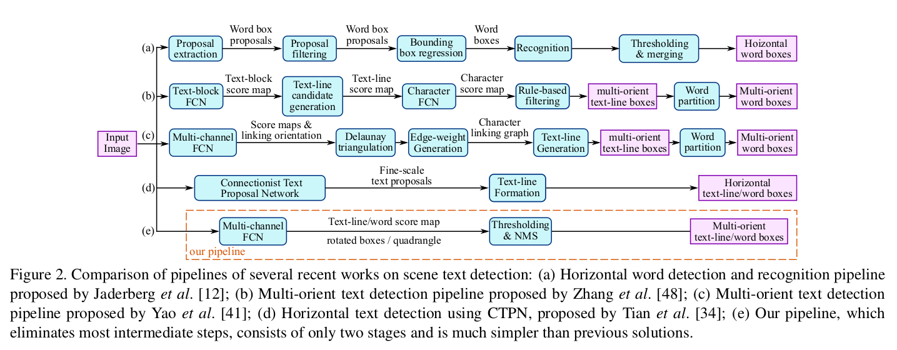

# EAST: An Efficient and Accurate Scene Text Detector

## 1. Abstract

+ Predicts words or text lines of arbitrary (anywhere) orientations & quadrilateral (tu giac)

+ Pipeline allows concentrating efforts on designing loss function & network architecture.

## 2. Introduction

+ The core of text detection is the design of features to distinguish text from backgrounds

+ The contributions of this model:

    - A scene text detection method consists 2 stage:

        - A Fully Convolutional Network -> text region

        - An NMS merging stage

## 3. Methodology

+ Model to directly predict the *text instance* & *their geometries*

+ The model ~ a fully convolution neural network that outputs dense (day dac) per-pixel predictions of texts in line.

    - the post-processing steps only include thresholding & NMS to predict geometric shapes.

### 3.1 Pipeline

+ The network must use features from different level

    - large for the exist of large words

    - small for a small word regions