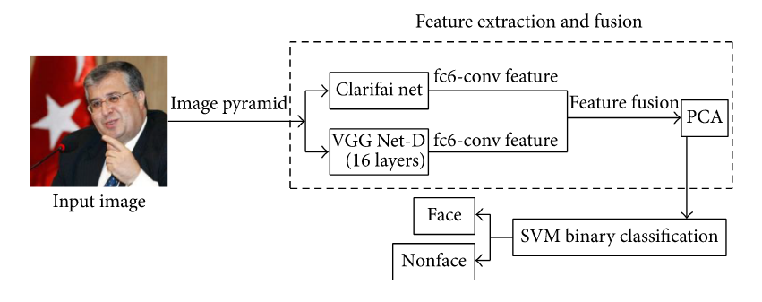
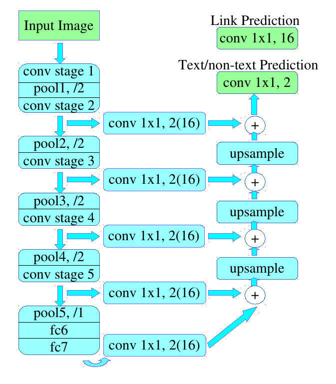

# PixelLink: Detecting Scence Text via Instance Segmentation

## 0. Các khái niệm cần làm rõ

### 0.1 Instance segmentation

+ Thực hiện nhận diện các đối tượng ở cấp độ điểm ảnh, mỗi đối tượng sẽ có 1 vùng các điểm ảnh riêng. Khác với *semantic segmentation* chỉ nhận diện 1 đối tượng duy nhất trong ảnh, *instance segmentation* sẽ nhận diện nhiều đối tượng trong cùng 1 ảnh.

    
        
    [Nguồn](https://towardsdatascience.com/understanding-semantic-segmentation-with-unet-6be4f42d4b47)

### 0.2 Regression-based
+ Có thể hiểu là vị trí của vùng đối tượng được suy ra từ các bounding boxes mà mô hình dự đoán. 

### 0.3 Soft max

### 0.4 Feature fusion layers
+ Có thể hiểu như việc kết hợp đặc trưng của các pretrained model để phục vụ cho việc học mới. Một ví dụ về **feature fusion** được đề cập trong bài báo [Feature Extraction and Fusion Using Deep Convolutional Neural Networks for Face Detection](https://www.hindawi.com/journals/mpe/2017/1376726/). 

    
+ Để tránh loãng bài viết, từ khóa này mình sẽ làm rõ (cập nhật) trong chủ đề về **Transfer Learning**, mọi người có thể đọc ở [đây](https://github.com/Doan-Nguyen/Deep_Learning_Notes/blob/master/Topics/TransferLearning/transfer_learning.md). 

### PixelLink+VGG16-2s & PixelLink+VGG16-4s
+ PixelLink+VGG16 2s: 
    - Có kích thước bằng 1 nửa ảnh gốc. 

+ PixelLink+VGG16 4s:
    - Có kích thước bằng 1/4 ảnh gốc.

## 1. Sơ lược về bài toán 
+ Bài toán *text detection* hay thường biết đến với tên OCR là một bài toán phổ biến. Những thuật toán gần thời điểm bài báo ra đời thường tập trung detect dựa vào *bounding box regression* thông qua 2 output dự đoán: *text/non-text score* & *vị trí regression*.

+ Ở đây tác giả có đề cập đến việc, *text/non-text score* cũng trả về thông tin về vị trí của text, điều này khiến vai trò của *location regression* giảm bớt đi. Mình xin trích dẫn cấu trúc 1 mạng trong bài báo "Text/Non-text Image Classification in the Wild with Convolutional Neural Networks" [Link](https://www.researchgate.net/publication/311578437_TextNon-text_Image_Classification_in_the_Wild_with_Convolutional_Neural_Networks). Khi xác định *text/non-text score*, mô hình đã chia ảnh thành nhiều phân vùng, rồi từ đó xác định khả năng tồn tại của text:        
        
    

## 2. Ý tưởng, cải tiến của thuật toán
+ Các thuật toán trước:  
    - Ý tưởng đầu tiên **Regression-based Text Detection**, xác định vị trí text thông qua text proposals (được đề cập trong CTPN). Phát triển từ *anchor* trong bài toán *object detection* đề xác định một phần text & kết nối với nhau thông qua cơ chế liên kết (vd: RNN). Ở đây, số lượng anchor nhiều để có thể detect được các text có kích thước da dạng.
    - Ý tưởng khác **Segmentation-based Text Detection**, việc xác định vị trí text được coi như bài toán *semantic segmentation problem* thông qua dự đoán 3 tham số:
        - text/non text score
        - character classes
        - character linking orientations 
    - Nói thêm, với bài toán nhận diện chữ tiếng Nhật, detect orientations đóng vai trò quan trọng vì nó quyết định mô hình có xác định vị trí với trường hợp chữ dọc hay khống. Thuật toán CTPN mà mình đã phân tích, nó không giải quyết trường hợp này nhưng bù lại vì sử dụng *cơ chế vertical anchor* trong chuỗi thuật toán R-CNN nên có thể cải thiện về mặt tốc độ so với PixelLink.

+ Ý tưởng thuật toán PixelLink đề xuất:
    - Vấn đề:
        - Khi các text quá sát nhau, việc *semantic segmentation* trở lên khó khăn để segmentation từ kí tự.
    - Đề xuất:
        - Việc xác định vị trí text bằng *instance segmentation* thay cho *bounding boxes regression*. Mô hình **Pixel Link** dự đoán 2 kết quả:
            - text/non-text prediction {các điểm ảnh trong vùng text xuất hiện được gán nhãn *positive* & ngược lại}
            - link prediction
                - Việc liên kết các điểm ảnh diễn ra giữa điểm ảnh đang xét với 8 điểm ảnh *hàng xóm*.
                - Xét 2 cặp điểm ảnh {điểm ảnh trung tâm, 1 trong 8 điểm ảnh}.
                    - Nếu nằm cùng một kí tự trong text (nguyên gốc: *same instance*) sẽ được đánh nhãn *positive* & ngược lại.
                - Các điểm ảnh được gán nhãn *positive* sẽ được join vào cùng *Connected Components*
                - Mỗi một *Connected Components* được coi như 1 text.

## 3. Phân tích thuật toán 
+ Bài toán Text Detection chuyển về bài toán *Instance Segmentation*, mô tả thuật toán gồm 2 bước:
    - Xác định tập hợp điểm ảnh được gán nhãn *positive*.
    - Nhóm chúng lại với nhau bởi việc xác định tính *positive links*. 
    - Từ các vùng instance segmentation vẽ các bounding boxes.

### 3.1 Kiến trúc thuật toán
+ Tương tự như SegLink, PixelLink sử dụng VGG-16 làm nhiệm vụ phân tích đặc trưng:
    - Thay thế các lớp *fc_6*, *fc_7* thành lớp *convolutional*.
+ Từ việc lựa chọn các lớp convolutional từ mạng VGG-16 kết nối với lớp *fc_7* tạo thành 2 cách thức *feature fusion*:
    - **PixelLink+VGG16 2s**: *{conv2 2, conv3 3, conv4 3, conv5 3, fc 7}*
    - **PixelLink+VGG16 4s**: *{conv3 3,conv4 3, conv5 3, fc 7}*

+ Kiến trúc của *PixelLink+VGG16 2s*:
    

### 3.2 Kết nối các Pixels 

### 

## 4. Tối ưu thuật toán

## Tài liệu tham khảo

[Transfer learning](https://forum.machinelearningcoban.com/t/tong-hop-transfer-learning/5388)
