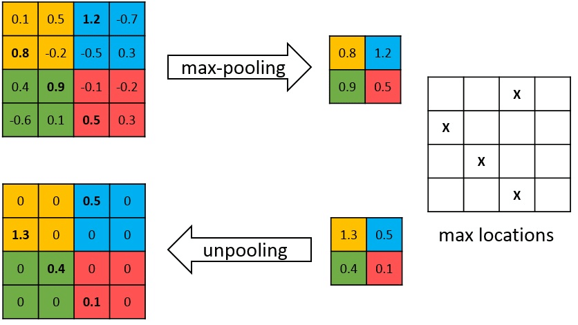

# 1. Functions


## 1.1 BatchNorm
https://towardsdatascience.com/batch-normalization-in-neural-networks-1ac91516821c

+ **What ?**
    - Chuẩn hóa các features về trạng thái zero-mean với độ lệch chuẩn 1.

        - *zero-mean* dữ liệu không phân bố quanh giá trị 0

        - *zero-mean* + high variance ~> dữ liệu không đồng đều/ độ chênh lệch lớn => ảnh hưởng đến quá trình tối ưu (đạo hàm)

+ **How it works ?**

    
    
+ **When & where using ?**

    - Usually, it appears between a *full connected layer /convolution layer* and *activation layers* 

    - Khi các mẫu trong 1 batch tương đồng, sấp xỉ nhau ~> trung bình/phương sai = 0 => không nên dùng *batchnorm*

+ **Properties**

    - *Faster training*:

    - *Regularization*


## 1.2 Region Proposal Networks

+ Tạo ra *proposals* trên vùng mà đối tượng tồn tại. Sử dụng 1 mạng nhỏ như 1 slide trượt trên *convolution feature map* 


## 1.3 ReLU(inplace=True)


## 1.4 Unpooling layer
    - Khôi phục lại features map bằng việc giữ giá trị lớn nhất & thay các giá trị thành phần nhỏ hơn bằng 0

    


## 1.5 Kaiming Initialization

+ if **create weight implicitly by creating a linear layer** => set *model='fan_in'*

+ if **create weight explicitly by creating a random matrix** => set *model='fan_out'*

### 1.5.1 Weight Initiliazation Matters

    ```
    W = W — ⍺ * dW
    ```

+ Why care about *weight initialization* ?

    - Random initialize the weight, will cause 2 problems:

        - *vanishing (lose/remove) gradient problem*

        - *exploding gradient problem*

    - **Vanishing gradient problem** ~ weights vanish to 0

        - Nếu khởi tạo weight nhỏ (< 1), trong 1 mạng neural nhiều lớp. Quá trình backpropagation sẽ làm triệt tiêu dần weight.

    - **Exploding gradient problem** ~ weight explode to infinity  
        - Nếu khởi tạo weight rất lớn (> 1)

### 1.5.2 Why Kaiming initialization works ?


## 1.6 Understanding interpolate of nn.

+ Same *nn.UpsamplingBilinear2d()*

+ Example 


